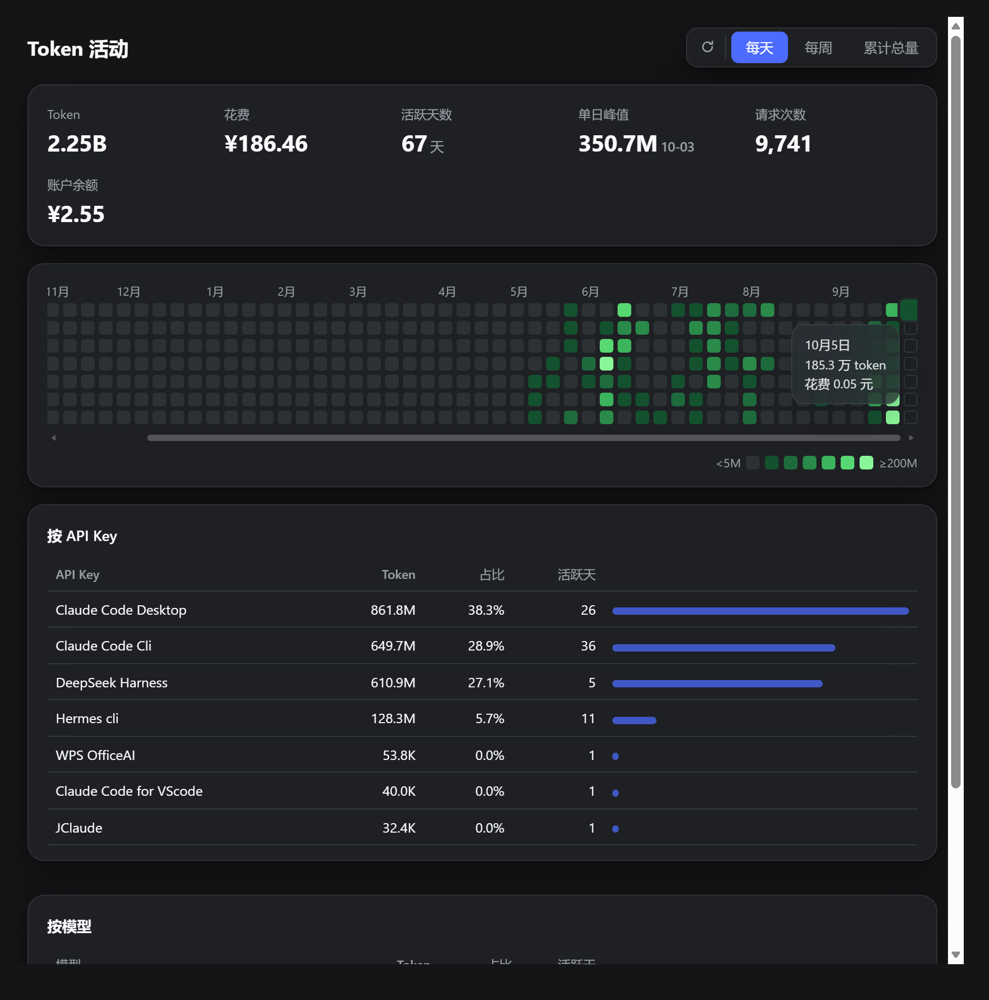

# dsh-platform-usage

在 DSH 的设置页里看 DeepSeek 开放平台的**账号级** Token 活动：52 周热力图，可切每天 / 每周 / 累计总量。

跟常见的用量面板差别在一个口径上。DSH 插件通常读本地会话日志，看到的是 DSH 自己花了多少；这个插件读的是平台账号数据，看到的是**该账号下所有 API Key 合计花了多少**——你在 Claude Code、Hermes、WPS 或者自己写的脚本里调 API，一样会算进来。判断依据是接口返回里每条用量都带 API Key 名字，按 Key 拆开就知道钱花在哪个工具上了。

不是 DeepSeek 官方项目，数据取自官方平台而已。



## 当前状态

**能用的**：数据采集与展示全部可用。热力图、三档切换、六项统计、按 Key / 按模型两张拆分表、悬停详情、刷新键、动画，都是真实数据跑通的。

**已修**（都有实测数字）：

| 问题 | 症状 | 处理 |
| --- | --- | --- |
| 月份标签漂移 | 53 列里越往右偏得越多，实测到 9 月偏 **83px ≈ 5 个格子** | 标签改为绝对定位 `left = 列索引 × 17px`，与格子几何一致；12 个标签偏差归零 |
| 暗色四档太暗 | 四档绿压在深灰底上，62 个有色格子里 38 个落在最暗两档，远看一片糊 | 提亮四档（`#0e4429`→`#1a5c38` 等） |
| 主题判定错位 | 面板认系统偏好、DSH 认应用内设置，两者可不一致 | 面板改为跟随宿主主题，见下 |

**没解决的**：**深色模式下这个面板在某些环境下仍然是白底。**

我在测试环境里已经把它跑通了（宿主只在 `body` 上放主题变量的场景，面板判定为 dark，卡片 `rgba(38,41,46,.55)`、文字 `rgb(232,234,237)`），但在**真实的 DSH Desktop 里仍然是白底**。真机环境我拿不到 DOM，所以还没定位到根因。判定过程记录在 `window.__OU_DIAG__`，有环境能复现的话可以从这里切入。

详见下面「待解决」。

## 做到了什么

热力图的每格是一天，颜色按**绝对阈值**分档（1M / 10M / 50M / 100M），不是按相对排名——所以三月和九月的格子可以直接比深浅，不会因为「那个月整体都低」而看起来一样绿。三档切换里，累计总量是那条从年初爬到现在的线。

统计行六个数字：区间内 Token、花费、活跃天数、单日峰值（带日期）、请求次数、账户余额（充值加赠金合并）。

两张拆分表：按 API Key、按模型。前者是这个插件存在的理由，后者能看出 deepseek-v4-pro 和 flash 谁在吃预算。

动效参考 Codex 那个 `/usage` 的手感：格子按列错开 22ms 逐个长出来（切换档位时重播）、统计数字滚动、表格行淡入、悬停格子放大。全部包在 `prefers-reduced-motion` 里，系统关了动效就全禁用，不会有人被动画烦到。

刷新键在标题行右侧，点它跳过缓存重新采集，采完重播一次生长动画。失败时图标变红抖两下，鼠标停上去能看到原因。

几个实现上的决定，值得单独说：

- 面板跑在 iframe 里，同源加载 host 的路由。这样面板的 CSS 和 DSH 互不污染，面板就是一份完整的独立 HTML，改起来不用碰 DSH。
- 界面源码只有一份（`src/panel/template.html`），独立文件版和插件版都由它生成。
- 设置页导航那个 3×3 图标是补丁画出来的，因为 DSH 的 `settings.section` 槽位没有 `icon` 字段，第三方分区一律只能拿到齿轮。

## 待解决

### 深色模式下仍然白底（未解决）

**现象**：DSH 处于深色模式，面板却是白底。控制台、设置窗口都是深色，只有这个面板是白的。

**已经做了什么**：面板的主题判定现在按四级优先，逐级回退：

1. 宿主传的 `?theme=dark|light` 参数（客户端读 `ctx.theme.getTheme()` 得到，`inject` 里已声明 `theme`，走的是 DSH 官方主题服务的契约）
2. 顺着 frame 链往上读宿主文档：根元素读不到就在宿主文档里插隐藏探针，量它**继承后的实际值**（自定义属性会继承）
3. 直接读 CSS 变量 `--dsw-alias-bg-base` 等的亮度
4. 系统偏好 `prefers-color-scheme`

**已经确认的宿主契约**（从 `app.asar` 内的 `@deepseek-ai/dsh-client-ui-theme` 读出来的，不是猜的）：

```js
buildSnapshot() {
  const resolvedId = this.preference === 'system'
    ? (this.media?.matches === true ? 'dark' : 'light')
    : this.preference
  return { preference, fontSize, active: composeActive(active), themes, revision }
}
// active.colorScheme 是 'light' | 'dark'，嵌在 active 里
// DEFAULT_PREFERENCE = 'system'，即没设过主题时跟随系统
```

**为什么还没解决**：真机（DSH Desktop）里我拿不到 DOM，只能在无头浏览器里用自己搭的宿主复现。我的复现宿主和真实宿主至少还有一处没对齐——**我把测试宿主改成「主题变量只挂在 body 上」之后，面板侧就判定正确了，但真机仍然白底**，说明还有别的差异没找到。

**下一步可以从这里切入**：面板会把每一步判定记进 `window.__OU_DIAG__`（`{steps, chain, decided, source, param}`），客户端也会记进 `window.__OU_CLIENT_DIAG__`（含 `snapshotPreference` / `snapshotActiveId` / `snapshot` / `sample` / `cssVar` / `source`）。在有问题的环境里读这两个对象，就能知道它到底走到哪一级、读到了什么。

### 其它已知限制

- **依赖平台内部接口，不是公开契约。** 开放平台公开的用量相关 API 只有 `GET /user/balance` 一个，返回余额和赠金，没有任何按天、按模型、按 Key 的明细。逐日数据来自平台网页自己调用的 `/api/v0/usage/by_api_key/{amount,cost}`。平台改版就可能失效——真失效时面板会显示错误，不会假装还有数据。
- **单次最多查 7 天**，所以取满一年要 53 次请求。并发 4 路，冷启动约 2 秒，之后走 10 分钟缓存。想再往前取需要更多请求，目前没做。
- **接口不返回 CORS 头**，浏览器不能直连，必须由 DSH 进程代理。代价是装完必须重启一次 DSH。
- **token 会过期。** 失效后余额读不到、数据停更，得重新取一次。这串 token 权限比 API Key 大，只该放在本机。
- **拆不到会话。** 平台按 API Key 聚合，所以你知道「Claude Code 花了 643M」，但不知道「上周三那个调试会话花了多少」。
- **只在中文区验证过。** 用 `tz=28800`（东八区）对齐日界，其它区域没测过。
- **面板 iframe 高度写死 1180px。** 窗口特别矮时内部会滚动；没做自适应高度测量。
- **导航图标补丁会静默失效。** 宿主 DOM 变了图标就退回齿轮，不影响面板本体。
- **单机单人开发。** Windows + DSH Desktop 0.2.0-rc.2 验证通过，其它平台和版本没测。

## 开发过程中踩过的坑

这几条不是理论风险，是真踩进去过的，写下来避免重复：

**1. 模板字符串会吃掉正则转义。** 主题判定脚本原本写在 `build-panel.mjs` 的模板字符串里，`/rgba?\(\s*(\d+)/` 生成到产物里变成 `/rgba?(s*(d+)/`——`\s`、`\d`、`\(` 全被当转义处理了。结果是探测逻辑一直空转，而构建不报错。现在这段脚本单独放在 `src/panel/theme-boot.js`，按文件读入，且构建时对产物做**字面量断言**（不是正则断言，写断言时又踩过同一个坑）。

**2. `getComputedStyle` 对自定义属性返回原始写法。** 宿主写的是 `#16181c`（hex），我第一版只认 `rgb()`，解析失败后**静默**退回系统偏好。现在 hex 与 `rgb()`/`rgba()` 都支持。

**3. `rgba(0,0,0,0)` 会被算成纯黑。** 全透明颜色的亮度是 0，于是"没测到"被当成了"测到黑色"。现在 alpha ≤ 0.05 一律视为没测到，继续往下回退。

**4. 主题变量挂在 `body` 上，不在根元素。** 只读 `documentElement` 会永远取到空串。DSH 的 token 定义就是 `body{--dsw-static-…}` 这种形式。

**5. 只读顶层字段会漏掉嵌套契约。** `colorScheme` 在 `snapshot.active` 里，我第一次只在顶层找。

**最该记住的一条**：上面 5 个坑之所以反复出现，是因为**我编造的测试环境比真实环境"干净"**。测试宿主把主题变量放在根元素上、用 `rgb()` 写法、快照用顶层字段——每一条都和真实宿主不一样，于是每次都"测试通过但真机无效"。**照真实结构搭测试**比多写几个断言有用得多。

## 装

```sh
dsh plugin --profile desktop add link:<本仓库路径>/plugin
```

装完重启一次 DSH，设置里会多出「平台用量」。web profile 把 `desktop` 换成 `web`。

需要一个平台 token。登录 <https://platform.deepseek.com>，按 F12 打开 **Console**（中文界面叫「控制台」；如果打开的是 Node.js 控制台，里面没有 `localStorage`，会一直拿不到东西），执行：

```js
JSON.parse(localStorage.getItem('userToken')).value
```

把输出写进 `~/.dsh/.credentials.yaml`：

```yaml
  DEEPSEEK_PLATFORM_TOKEN: 粘贴到这里
```

环境变量 `DEEPSEEK_PLATFORM_TOKEN` 优先级更高，也认。

## 本机路由

```
GET /dsh-official-usage/api/state          逐日数据（按 Key × 模型），10 分钟缓存
GET /dsh-official-usage/api/state?fresh=1  跳过缓存重新采集
GET /dsh-official-usage/api/balance        实时余额
GET /dsh-official-usage/api/refresh        强制刷新，返回摘要
GET /dsh-official-usage/panel.html         面板本体，可加 ?theme=dark|light 指定主题
```

路由前缀是 `dsh-official-usage`（跟包名一致，跟仓库名不一致，历史原因）。

## 仓库结构

```
plugin/                 可直接安装的插件包
  lib/index.js          host：读 token、采集、聚合、注册路由
  lib/dashboard.html    面板本体（iframe 加载）
  client/client.js      浏览器端：注册设置分区、导航图标补丁、主题传递
  cordis.patch.yml      bundle 补丁
src/panel/template.html 面板源模板，独立版和插件版共用
src/panel/theme-boot.js 面板启动前的主题判定（被插进产物，别写进模板字符串）
tools/build-panel.mjs   由模板生成 plugin/lib/*
tools/test-client.mjs   客户端 bundle 的结构与运行时检查（31 项）
```

改面板：编辑 `src/panel/template.html`，跑 `node tools/build-panel.mjs`。是 link 安装的话刷新浏览器就生效；只有改 host 侧 `plugin/lib/index.js` 才需要重启 DSH。

## 验证方式

没有 CI，验证都是脚本跑一次的。开发中实际跑过：

- host 侧真实采集 53 周，与平台页面交叉核对（近一年费用 ¥168.55 对平台累计 ¥167.92，差额是当天还没结算的部分）
- 无头浏览器走真实插件路径渲染（371 格、7 个 Key、4 个模型、三档切换）
- 客户端 bundle 结构检查 31 项（含主题四级优先链，用的是宿主真实快照形状）
- 月份标签对齐：量每个标签与它所在列格子的实际偏差，12 个全为 0px
- 主题判定：分别用「变量在根元素」「变量在 body」「宿主暗/亮 × 系统暗/亮」等组合验证

一个教训：**只看截图会骗人。** 无头浏览器的 `--virtual-time-budget` 会冻住 CSS 入场动画，截出来的图总是发灰，我因此误判过好几次。改成直接读 `getComputedStyle` 的计算值之后，颜色和对齐都能给出精确数字。

## 借鉴了谁

界面方向和导航图标方案来自 **[zeng6125-rgb/dsh-usage-heatmap](https://github.com/zeng6125-rgb/dsh-usage-heatmap)**（BSD-3-Clause）。它也是把 DSH 用量画成 GitHub 风格热力图，走本地会话日志口径，跟这个插件正好互补——一个回答「DSH 自己花了多少」，一个回答「这个账号一共花了多少」。三档切换的设计和那个 CSS mask 画导航图标的做法，都是照着它的实现学的；`settings.section` 没有 `icon` 字段、第三方分区只能拿齿轮这件事，也是它实测出来的。

主题服务的接法参考了 **dshmarket** 的做法（`inject: ['slots','locale','theme']` + `ctx.theme.getTheme()` + `ctx.on('theme/change')`）。

热力图形态来自 GitHub 的贡献图，「Token 活动」这个标题和整体呈现参考了 Codex 的 `/usage`。

## License

[MIT](LICENSE)
